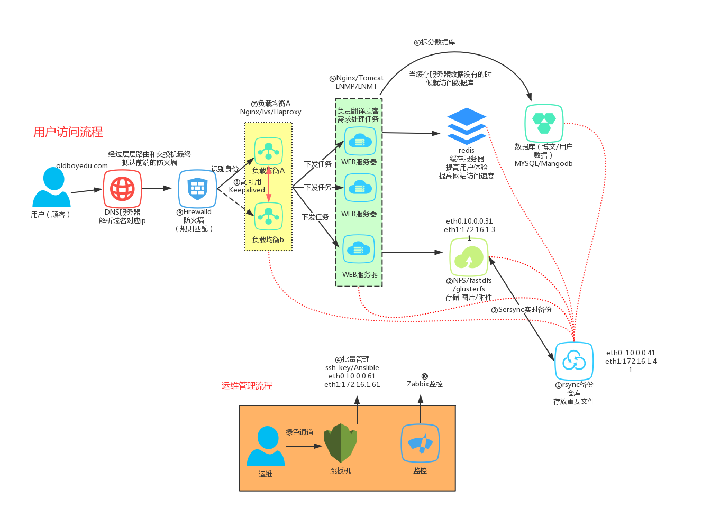

# ansible_linux_cluster
集群部署 ansible playbook

| ID   | 项目名称                              | 主机名及IP            |
| ---- | ------------------------------------- | --------------------- |
| 1    | 搭建PPTP VPN服务                      | 172.16.1.61/24/m01    |
| 2    | 配置无人值守安装服务(Cobbler)批量装机 | 172.16.1.61/24/m01    |
| 3    | NFS共享存储项目                       | 172.16.1.31/24/nfs    |
| 4    | NFS共享存储数据实时复制到backup       | 172.16.1.41/24/backup |
| 5    | SSH、Ansible,批量管理服务项目         | 172.16.1.61/24/m01    |
| 6    | YUM仓库/RPM包定制项目                 | 172.16.1.61/24/m01    |
| 7    | MySql数据库环境搭建                   | 172.16.1.51-52-53/24/ |
| 8    | Nginx+PHP流行动态Web环境搭建          |                       |
| 9    | Nginx+Tomcat流行动态环境搭建          |                       |
| 10   | 将PHP项目和Tomcat项目上传目录挂载NFS  |                       |
| 11   | Nginx静态Web服务环境搭建              |                       |
| 12   | 将Nginx+keepalived负载实现动静分离    |                       |
| 13   | 配置Nginx https加密访问项目           |                       |
| 14   | 搭建跳板机服务 jumpserver             |                       |
| 15   | 搭建Zabbix服务                        |                       |
| 16   | iptables 共享上网, ntp时间服务        |                       |
| 17   | ansible一键完成本套集群               |                       |
|      |                                       |                       |
|      |                                       |                       |

**网站架构图**    

 


## 1.用户访问网站流程

   1.用户通过浏览器输入www.chengkanghua.top->回车

   2.进行DNS解析->获取真实的公网IP地址

   3.用户通过tcp的三次握手发起连接->真实的公网IP

   4.连接会通过公网->路由器->交换机->抵达前端的防火墙

   5.防火墙根据自身访问规则，进行判定->如果恶意的连接则拒绝->如果是正常的连接则放行

   6.防火墙会将连接发送给负载均衡器->查看用户请求的内容->根据内容进行任务下发->下发给web服务器

   7.web服务接收请求后会根据请求进行判断

​     如果是请求图片或者附件->存储服务

​     如果请求的网站上的文章或者内容->缓存服务器->如果缓存服务器没有则->数据库

​     数据库查询完数据之后会返回数据给web服务器->同时也会返回一份给缓存服务器

   8.数据库返回内容->web服务器->负载均衡->用户

   五层架构模型-->  负载均衡  web服务  存储服务  缓存服务  数据库服务（通过tcp连接）


## 2.管理人员维护流程

1.用户通过公网连接（隧道）VPN服务器。

这样方便管理内部主机，并且可以实现批量管理主机，备份所有重要文件。

2.用户可以通过公网连接监控服务器（也可以使用其他方式去实现）


# 

```bash

主机名   eth0 网卡     eth1 网卡      服务简介
lb01    10.0.0.5/24   172.16.1.5/24  负载服务
lb02    10.0.0.6/24   172.16.1.6/24  负载服务
web01   10.0.0.7/24   172.16.1.7/24  动态 www 服务
web02   10.0.0.8/24   172.16.1.8/24  动态 www 服务
web03   10.0.0.9/24   172.16.1.9/24  tomcat 服务
db01    10.0.0.51/24  172.16.1.51/24  数据库服务
db02    10.0.0.52/24  172.16.1.52/24  数据库从库
db03    10.0.0.53/24  172.16.1.53/24  数据库从库
nfs01   10.0.0.31/24  172.16.1.31/24  存储服务
backup  10.0.0.41/24  172.16.1.41/24  备份服务
m01     10.0.0.61/24  172.16.1.61/24  管理服务
zabbix  10.0.0.71/24  172.16.1.71/24  监控服务


# ansible主机安装好ansible软件,把公钥推送所有机器;


#检测语法
[root@m01 ~]# ansible-playbook site.yml --syntax-check

#测试
[root@m01 ~]# ansible-playbook -C site.yml
```

